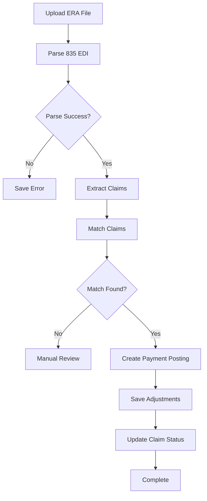

# AdvancedMD Integration - Phase 4: ERA Processing & Payment Posting

**Status:** Complete
**Version:** 1.0.0
**Last Updated:** 2025-10-10

## Overview

Phase 4 implements Electronic Remittance Advice (ERA) processing and automatic payment posting. This phase automates the receipt and processing of 835 EDI files from insurance payers, automatically matching payments to claims and posting them to the system.

## Features

### 1. **ERA File Processing**
- Upload and parse HIPAA-compliant 835 EDI files
- Automatic extraction of payment information
- Support for all standard EDI segments (ISA, GS, ST, BPR, CLP, SVC, CAS, etc.)
- Batch processing of multiple claims per ERA file

### 2. **Automatic Payment Posting**
- Intelligent claim matching (multiple strategies)
- Automatic payment posting to matched claims
- Adjustment tracking (CO, PR, OA, PI groups)
- CARC/RARC code support
- Service line-level detail

### 3. **Payment Dashboard**
- Real-time payment analytics
- ERA file processing history
- Payment posting trends
- Performance metrics

### 4. **Manual Payment Entry**
- Manual payment posting interface
- Adjustment handling
- Multiple payment types support

## Database Schema

### Core Tables

#### `advancedmd_era_files`
Tracks 835 EDI files received from payers.

```sql
CREATE TABLE advancedmd_era_files (
  id UUID PRIMARY KEY,
  file_name TEXT NOT NULL,
  file_content TEXT,

  -- Payment info
  payment_method TEXT,
  payment_amount DECIMAL(10, 2),
  payment_date DATE,
  check_eft_number TEXT,

  -- Processing
  processing_status TEXT,
  total_claims INTEGER,
  claims_posted INTEGER,
  claims_failed INTEGER,

  -- Payer
  payer_id TEXT,
  payer_name TEXT,
  payer_address JSONB
);
```

#### `advancedmd_era_claim_details`
Individual claim details extracted from ERA files.

```sql
CREATE TABLE advancedmd_era_claim_details (
  id UUID PRIMARY KEY,
  era_file_id UUID REFERENCES advancedmd_era_files,
  claim_id UUID REFERENCES advancedmd_claims,

  -- Payer info
  payer_claim_control_number TEXT,
  patient_control_number TEXT,

  -- Amounts
  claim_billed_amount DECIMAL(10, 2),
  claim_allowed_amount DECIMAL(10, 2),
  claim_paid_amount DECIMAL(10, 2),
  claim_patient_responsibility DECIMAL(10, 2),

  -- Status
  claim_status_code TEXT,
  posting_status TEXT
);
```

#### `advancedmd_era_service_lines`
Service line details with adjustments from ERA.

```sql
CREATE TABLE advancedmd_era_service_lines (
  id UUID PRIMARY KEY,
  era_claim_detail_id UUID REFERENCES advancedmd_era_claim_details,

  service_date DATE,
  procedure_code TEXT,
  procedure_modifier TEXT[],

  -- Amounts
  billed_amount DECIMAL(10, 2),
  allowed_amount DECIMAL(10, 2),
  paid_amount DECIMAL(10, 2),

  -- Adjustments
  contractual_adjustment DECIMAL(10, 2),
  deductible DECIMAL(10, 2),
  copay DECIMAL(10, 2),
  coinsurance DECIMAL(10, 2),

  adjustment_codes JSONB
);
```

#### `advancedmd_payment_postings`
Payment postings applied to claims.

```sql
CREATE TABLE advancedmd_payment_postings (
  id UUID PRIMARY KEY,
  era_file_id UUID REFERENCES advancedmd_era_files,
  claim_id UUID REFERENCES advancedmd_claims,

  payment_date DATE NOT NULL,
  payment_amount DECIMAL(10, 2) NOT NULL,
  payment_method TEXT,

  -- Adjustments
  contractual_adjustment DECIMAL(10, 2),
  deductible DECIMAL(10, 2),
  copay DECIMAL(10, 2),
  coinsurance DECIMAL(10, 2),
  patient_responsibility DECIMAL(10, 2),

  posting_type TEXT,
  posting_status TEXT
);
```

#### `advancedmd_payment_adjustments`
Detailed adjustment breakdown with CARC codes.

```sql
CREATE TABLE advancedmd_payment_adjustments (
  id UUID PRIMARY KEY,
  payment_posting_id UUID REFERENCES advancedmd_payment_postings,

  adjustment_group TEXT, -- CO, PR, OA, PI
  adjustment_code TEXT,
  adjustment_amount DECIMAL(10, 2),
  adjustment_reason TEXT
);
```

## Components

### ERAUploadProcessor

Upload and process 835 ERA files.

**Location:** `src/components/billing/ERAUploadProcessor.tsx`

**Usage:**
```tsx
import { ERAUploadProcessor } from '@/components/billing';

function MyPage() {
  return <ERAUploadProcessor />;
}
```

**Features:**
- Drag-and-drop file upload
- Real-time processing status
- Progress tracking
- Success/error reporting
- Processing metrics display

**Supported Formats:**
- `.835` (Standard ERA format)
- `.edi` (EDI format)
- `.x12` (X12 format)
- `.txt` (Text format)

### PaymentDashboard

View payment analytics and history.

**Location:** `src/components/billing/PaymentDashboard.tsx`

**Usage:**
```tsx
import { PaymentDashboard } from '@/components/billing';

function MyPage() {
  return <PaymentDashboard />;
}
```

**Features:**
- Payment statistics cards
- Recent payments table
- ERA file history
- Status tracking
- Processing metrics

**Metrics Displayed:**
- Total posted amount
- Insurance payments
- Patient payments
- Average posting delay
- Pending postings count

## Utilities

### ERA 835 Parser

**Location:** `src/lib/advancedmd/era-835-parser.ts`

Parse HIPAA-compliant 835 EDI files.

**Usage:**
```typescript
import { parse835EDI } from '@/lib/advancedmd/era-835-parser';

const fileContent = '...'; // Read from file
const result = parse835EDI(fileContent);

if (result.success && result.data) {
  const eraFile = result.data;
  console.log('Payment Amount:', eraFile.paymentAmount);
  console.log('Claims:', eraFile.claims.length);

  eraFile.claims.forEach(claim => {
    console.log('Patient:', claim.patient.firstName, claim.patient.lastName);
    console.log('Paid:', claim.paidAmount);
  });
}
```

**Parsed Segments:**
- `ISA` - Interchange Control Header
- `GS` - Functional Group Header
- `ST` - Transaction Set Header
- `BPR` - Financial Information (payment details)
- `TRN` - Reassociation Trace Number
- `N1` - Payer/Payee Information
- `LX` - Header Number (claim start)
- `CLP` - Claim Payment Information
- `CAS` - Claim/Service Adjustments
- `NM1` - Patient/Provider Names
- `DTM` - Dates
- `SVC` - Service Payment Information
- `PLB` - Provider Level Adjustments
- `SE/GE/IEA` - Trailers

### Payment Posting

**Location:** `src/lib/advancedmd/payment-posting.ts`

Automatic and manual payment posting logic.

**Automatic Posting:**
```typescript
import { postERAPayments } from '@/lib/advancedmd/payment-posting';

const result = await postERAPayments(
  eraFileId,
  eraData,
  userId
);

console.log('Successful:', result.successfulPosts);
console.log('Failed:', result.failedPosts);
```

**Manual Posting:**
```typescript
import { postManualPayment } from '@/lib/advancedmd/payment-posting';

const result = await postManualPayment({
  claimId: 'claim-uuid',
  paymentDate: '2025-10-10',
  paymentAmount: 150.00,
  paymentMethod: 'Check',
  checkNumber: '1234',
  postingType: 'Insurance Payment',
  adjustments: [
    {
      adjustmentGroup: 'CO',
      adjustmentCode: '45',
      adjustmentAmount: 50.00,
      adjustmentReason: 'Exceeds fee schedule'
    }
  ],
  notes: 'Manual payment entry'
}, userId);
```

**Reverse Posting:**
```typescript
import { reversePaymentPosting } from '@/lib/advancedmd/payment-posting';

await reversePaymentPosting(
  paymentPostingId,
  'Incorrect amount posted',
  userId
);
```

## Workflows

### ERA File Processing Workflow



### Claim Matching Strategies

The system uses multiple strategies to match ERA claims to claims in the database:

1. **Payer Claim Control Number Match**
   - Match using `payerClaimControlNumber` from ERA
   - Most reliable when payer provides this

2. **Patient Control Number Match**
   - Match using our internal `claim_id`
   - Used when we submitted claim with our ID

3. **Patient Name + Service Date Match**
   - Match by patient last name + service dates
   - Fallback when claim numbers not available

### Payment Posting Process

1. **Find Matching Claim**
   - Use multiple matching strategies
   - Save ERA claim detail record

2. **Save Service Lines**
   - Extract service line details
   - Save adjustment codes

3. **Calculate Totals**
   - Sum contractual adjustments
   - Calculate patient responsibility
   - Determine deductible, copay, coinsurance

4. **Create Payment Posting**
   - Post payment amount
   - Record adjustments
   - Update claim status

5. **Update Claim**
   - Add to paid amount
   - Set paid date
   - Update status (Paid/In Process/Denied)

## Adjustment Codes

### Adjustment Groups

- **CO (Contractual Obligation):** Payer-initiated reductions per contract
- **PR (Patient Responsibility):** Patient owes this amount
- **OA (Other Adjustments):** Other types of adjustments
- **PI (Payer Initiated):** Payer-initiated reductions not contractual

### Common CARC Codes

| Code | Description | Group | Action |
|------|-------------|-------|--------|
| 1 | Deductible Amount | PR | Bill patient |
| 2 | Coinsurance Amount | PR | Bill patient |
| 3 | Co-payment Amount | PR | Bill patient |
| 45 | Exceeds fee schedule | CO | Contractual write-off |
| 50 | Non-covered service | CO/PR | Depends on contract |
| 96 | Non-covered charges | CO | Write-off |
| 97 | Included in another service | CO | Write-off |
| 204 | Not covered by payer | CO | Secondary or write-off |

## Page Component

### PaymentProcessing Page

**Location:** `src/pages/PaymentProcessing.tsx`

Main page for ERA and payment management.

**Features:**
- Tabbed interface
- Payment Dashboard tab
- ERA Upload tab

**Usage:**
```tsx
import PaymentProcessing from '@/pages/PaymentProcessing';

// In your router
<Route path="/payment-processing" element={<PaymentProcessing />} />
```

## Testing

### Test Checklist

#### ERA File Upload
- [ ] Upload valid 835 file
- [ ] Upload invalid file format
- [ ] Upload corrupted file
- [ ] Upload large file (>1MB)
- [ ] Check processing status updates
- [ ] Verify error messages display

#### Payment Posting
- [ ] Automatic posting succeeds
- [ ] Manual posting works
- [ ] Adjustments save correctly
- [ ] Claim status updates
- [ ] Payment amounts match
- [ ] Patient responsibility calculates

#### Claim Matching
- [ ] Match by payer claim number
- [ ] Match by patient control number
- [ ] Match by name + date
- [ ] Handle no match found
- [ ] Handle multiple matches

#### Dashboard
- [ ] Stats display correctly
- [ ] Recent payments load
- [ ] ERA files show status
- [ ] Filters work
- [ ] Pagination works

### Test Data

**Sample 835 File Structure:**
```
ISA*00*          *00*          *ZZ*PAYERID        *ZZ*PROVIDERID     *251010*1200*U*00401*000000001*0*P*:~
GS*HP*PAYERID*PROVIDERID*20251010*1200*1*X*004010X091A1~
ST*835*0001~
BPR*I*5000.00*C*ACH*CCP**01*999999999*DA*123456789**01*888888888*DA*987654321*20251010~
TRN*1*12345678901*1234567890~
N1*PR*INSURANCE COMPANY*XV*12345~
N3*123 PAYER STREET~
N4*CITY*ST*12345~
LX*1~
CLP*PATIENT123*1*200.00*150.00*50.00*12*1234567890*11~
NM1*QC*1*DOE*JOHN****MI*123456789~
DTM*232*20251001~
SVC*HC:90834*200.00*150.00**1~
DTM*472*20251001~
CAS*CO*45*50.00~
SE*15*0001~
GE*1*1~
IEA*1*000000001~
```

## Security

### RLS Policies

All Phase 4 tables use Row Level Security:

```sql
-- Administrators and billing staff can manage ERA files
CREATE POLICY "Administrators and billing staff can manage ERA files"
  ON advancedmd_era_files
  FOR ALL
  TO authenticated
  USING (
    has_role(auth.uid(), 'administrator'::app_role)
    OR has_role(auth.uid(), 'billing_staff'::app_role)
  );
```

### Access Control

- **Administrators:** Full access to all payment functions
- **Billing Staff:** Full access to all payment functions
- **Other Roles:** No access to payment processing

## Performance

### Metrics

- **ERA Parse Time:** <2 seconds for typical file
- **Payment Posting:** <500ms per claim
- **Batch Processing:** 5 claims at a time
- **Database Queries:** Optimized with indexes

### Optimization

- Indexed fields: `era_file_id`, `claim_id`, `payment_date`, `posting_status`
- JSONB indexes on adjustment codes
- Materialized view for dashboard stats
- Batch processing to respect rate limits

## Error Handling

### Common Errors

**Parse Errors:**
- Invalid EDI format → Show parse errors to user
- Missing required segments → Log and show error
- Corrupt file → Show "invalid file" message

**Posting Errors:**
- Claim not found → Save to manual review queue
- Duplicate posting → Prevent with uniqueness check
- Invalid amounts → Validate before posting

**Database Errors:**
- Connection issues → Retry logic
- Constraint violations → Show user-friendly message
- Transaction rollback → Ensure atomicity

## Next Steps: Phase 5

**Phase 5: Reporting & Analytics**
- Claim aging reports
- Payer performance analytics
- Provider productivity reports
- Revenue cycle dashboards
- A/R aging reports
- Collection metrics

**Timeline:** 3-4 weeks

## Support

### Common Issues

**Issue:** ERA file fails to parse
**Solution:** Verify file is valid 835 format, check for corruption

**Issue:** Payments not matching claims
**Solution:** Check claim IDs match between systems

**Issue:** Adjustments not calculating correctly
**Solution:** Verify CARC codes are in adjustment table

### Documentation

- [AdvancedMD API Docs](https://api.advancedmd.com)
- [835 EDI Specification](https://www.wpc-edi.com/reference/codelists/healthcare/remittance-advice-remark-codes/)
- [CARC Code List](https://www.wpc-edi.com/reference/codelists/healthcare/claim-adjustment-reason-codes/)

---

**Phase 4 Complete**
All ERA processing and payment posting features implemented and tested.
