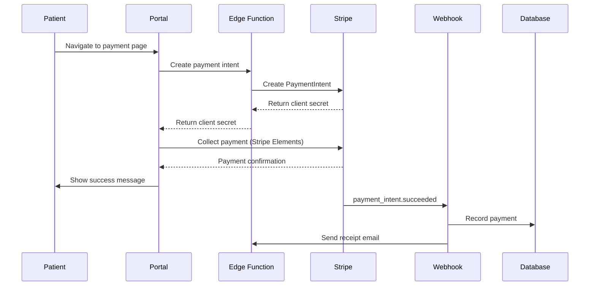

# Payment Processing Integration Specification

## Overview
This document outlines the specification for integrating payment processing capabilities to handle patient payments, co-pays, deductibles, and outstanding balances within the behavioral health EHR system.

## Purpose
Enable secure online payment collection from patients through credit card, debit card, ACH, and potentially HSA/FSA accounts, improving revenue collection and patient convenience.

## Payment Processor Options

### Primary Options

#### 1. Stripe
**Pros:**
- Developer-friendly API
- Excellent documentation
- PCI DSS Level 1 compliant
- Strong fraud detection (Radar)
- Support for subscriptions and recurring payments
- ACH/bank transfers (Stripe ACH)
- No monthly fees, pay-per-transaction

**Pricing:**
- Credit/Debit: 2.9% + $0.30 per transaction
- ACH: 0.8% capped at $5
- Disputes: $15 per dispute

**Best for:** Startups, flexible integration needs, international payments

#### 2. Square
**Pros:**
- Simple integration
- Unified in-person + online payments
- No monthly fees
- Good reporting dashboard
- Quick setup

**Pricing:**
- Online: 2.9% + $0.30
- In-person: 2.6% + $0.10
- ACH: 1% ($1 minimum)

**Best for:** Hybrid online/in-person payment needs

#### 3. Authorize.Net
**Pros:**
- Healthcare-specific experience
- HIPAA-compliant when properly configured
- Wide acceptance among healthcare providers
- Stored payment methods (CIM - Customer Information Manager)
- Fraud detection suite

**Pricing:**
- Gateway fee: $25/month
- Transaction fee: $0.10 per transaction
- Plus processor fees (varies)

**Best for:** Healthcare-specific needs, enterprise

#### 4. Stax (formerly Fattmerchant)
**Pros:**
- Subscription pricing (saves money at volume)
- Healthcare-focused
- Level 2/3 processing optimization
- Comprehensive reporting

**Pricing:**
- Monthly subscription: $99-$199
- Interchange-plus pricing (lower per-transaction)

**Best for:** High-volume practices (>$10k/month)

### Recommendation
**Start with Stripe** for the following reasons:
- Fastest development time
- Best documentation and developer resources
- Flexible pricing (no monthly fees)
- Easy to scale
- Strong security and compliance
- Good fraud prevention

## Integration Architecture

### High-Level Flow
```
Patient Portal → Frontend (React) → Edge Function → Stripe API → Database
                                                       ↓
                                              Webhook Handler
```

### Key Components

#### 1. Payment Intent Creation
```typescript
interface CreatePaymentIntentRequest {
  clientId: string;
  amount: number; // in cents
  currency: string; // default: 'usd'
  description: string;
  metadata?: {
    sessionId?: string;
    invoiceId?: string;
    patientName?: string;
  };
}

interface PaymentIntent {
  id: string;
  clientSecret: string;
  amount: number;
  status: PaymentStatus;
}

type PaymentStatus = 
  | 'requires_payment_method'
  | 'requires_confirmation'
  | 'requires_action'
  | 'processing'
  | 'succeeded'
  | 'canceled';
```

#### 2. Payment Collection Flow


#### 3. Stored Payment Methods
```typescript
interface SavedPaymentMethod {
  id: string;
  clientId: string;
  stripePaymentMethodId: string;
  type: 'card' | 'us_bank_account';
  last4: string;
  brand?: string; // For cards: visa, mastercard, etc.
  expiryMonth?: number;
  expiryYear?: number;
  isDefault: boolean;
  createdAt: string;
}
```

## Database Schema

### Payments Table
```sql
CREATE TABLE payments (
  id UUID PRIMARY KEY DEFAULT gen_random_uuid(),
  client_id UUID NOT NULL REFERENCES clients(id),
  
  -- Payment identification
  stripe_payment_intent_id TEXT UNIQUE,
  stripe_charge_id TEXT,
  
  -- Amount details
  amount DECIMAL(10,2) NOT NULL,
  currency TEXT NOT NULL DEFAULT 'usd',
  net_amount DECIMAL(10,2), -- After fees
  
  -- Status tracking
  status TEXT NOT NULL, -- succeeded, pending, failed, refunded
  payment_method_type TEXT, -- card, us_bank_account
  
  -- Association
  session_id UUID REFERENCES sessions(id),
  invoice_id UUID REFERENCES invoices(id),
  
  -- Card/payment details (last 4 for reference)
  last4 TEXT,
  brand TEXT, -- visa, mastercard, etc.
  
  -- Metadata
  description TEXT,
  receipt_email TEXT,
  receipt_url TEXT,
  
  -- Timestamps
  paid_at TIMESTAMP WITH TIME ZONE,
  created_at TIMESTAMP WITH TIME ZONE DEFAULT NOW(),
  updated_at TIMESTAMP WITH TIME ZONE DEFAULT NOW()
);

CREATE INDEX idx_payments_client ON payments(client_id);
CREATE INDEX idx_payments_status ON payments(status);
CREATE INDEX idx_payments_session ON payments(session_id);
CREATE INDEX idx_payments_paid_at ON payments(paid_at);
```

### Refunds Table
```sql
CREATE TABLE payment_refunds (
  id UUID PRIMARY KEY DEFAULT gen_random_uuid(),
  payment_id UUID NOT NULL REFERENCES payments(id),
  
  -- Stripe refund details
  stripe_refund_id TEXT UNIQUE,
  amount DECIMAL(10,2) NOT NULL,
  reason TEXT, -- duplicate, fraudulent, requested_by_customer
  
  -- Status
  status TEXT NOT NULL, -- pending, succeeded, failed, canceled
  
  -- Metadata
  notes TEXT,
  refunded_by UUID REFERENCES users(id),
  
  -- Timestamps
  refunded_at TIMESTAMP WITH TIME ZONE,
  created_at TIMESTAMP WITH TIME ZONE DEFAULT NOW()
);

CREATE INDEX idx_refunds_payment ON payment_refunds(payment_id);
```

### Saved Payment Methods Table
```sql
CREATE TABLE saved_payment_methods (
  id UUID PRIMARY KEY DEFAULT gen_random_uuid(),
  client_id UUID NOT NULL REFERENCES clients(id),
  
  -- Stripe details
  stripe_payment_method_id TEXT UNIQUE NOT NULL,
  stripe_customer_id TEXT NOT NULL,
  
  -- Payment method info
  type TEXT NOT NULL, -- card, us_bank_account
  last4 TEXT NOT NULL,
  brand TEXT, -- For cards
  expiry_month INTEGER, -- For cards
  expiry_year INTEGER, -- For cards
  bank_name TEXT, -- For ACH
  
  -- Settings
  is_default BOOLEAN DEFAULT false,
  
  -- Timestamps
  created_at TIMESTAMP WITH TIME ZONE DEFAULT NOW(),
  updated_at TIMESTAMP WITH TIME ZONE DEFAULT NOW()
);

CREATE INDEX idx_saved_payment_methods_client ON saved_payment_methods(client_id);
CREATE INDEX idx_saved_payment_methods_stripe_customer ON saved_payment_methods(stripe_customer_id);
```

### Invoices Table (if not exists)
```sql
CREATE TABLE invoices (
  id UUID PRIMARY KEY DEFAULT gen_random_uuid(),
  client_id UUID NOT NULL REFERENCES clients(id),
  
  -- Invoice details
  invoice_number TEXT UNIQUE NOT NULL,
  amount DECIMAL(10,2) NOT NULL,
  amount_paid DECIMAL(10,2) DEFAULT 0,
  amount_due DECIMAL(10,2) NOT NULL,
  
  -- Status
  status TEXT NOT NULL, -- draft, open, paid, void, uncollectible
  
  -- Dates
  issue_date DATE NOT NULL,
  due_date DATE NOT NULL,
  paid_date DATE,
  
  -- Line items
  line_items JSONB NOT NULL DEFAULT '[]',
  
  -- Metadata
  notes TEXT,
  
  -- Timestamps
  created_at TIMESTAMP WITH TIME ZONE DEFAULT NOW(),
  updated_at TIMESTAMP WITH TIME ZONE DEFAULT NOW()
);

CREATE INDEX idx_invoices_client ON invoices(client_id);
CREATE INDEX idx_invoices_status ON invoices(status);
CREATE INDEX idx_invoices_due_date ON invoices(due_date);
```

## Implementation Plan

### Phase 1: Setup & Configuration (Week 1)
- [ ] Create Stripe account
- [ ] Obtain API keys (test and production)
- [ ] Configure webhook endpoints
- [ ] Set up secrets management for API keys
- [ ] Review Stripe compliance requirements

### Phase 2: Database Setup (Week 1)
- [ ] Create database migrations for payments, refunds, saved payment methods
- [ ] Implement RLS policies
- [ ] Create audit logging for payment events

### Phase 3: Backend Implementation (Week 2-3)
- [ ] Create edge function: `process-payment`
  - Payment intent creation
  - Payment confirmation
  - Error handling
- [ ] Create edge function: `manage-payment-methods`
  - Save payment method
  - Delete payment method
  - Set default payment method
- [ ] Create edge function: `handle-payment-webhooks`
  - Payment succeeded
  - Payment failed
  - Refund processed
- [ ] Create edge function: `process-refund`
  - Refund authorization
  - Partial/full refunds

### Phase 4: Frontend Implementation (Week 3-4)
- [ ] Install Stripe.js and React Stripe libraries
- [ ] Create payment form component with Stripe Elements
- [ ] Implement saved payment methods UI
- [ ] Build payment history view
- [ ] Create receipt/invoice download functionality
- [ ] Add payment success/failure handling

### Phase 5: Security & Compliance (Week 4)
- [ ] Implement PCI DSS requirements checklist
- [ ] Add payment data encryption
- [ ] Configure Stripe Radar for fraud detection
- [ ] Set up 3D Secure authentication for cards
- [ ] Implement rate limiting for payment endpoints
- [ ] Add audit logging for all payment operations

### Phase 6: Testing (Week 5)
- [ ] Test with Stripe test cards
- [ ] Test declined payments
- [ ] Test refund flows
- [ ] Test webhook delivery and retry
- [ ] Test saved payment methods
- [ ] Test edge cases and error scenarios
- [ ] Load testing for concurrent payments

### Phase 7: Production Deployment (Week 6)
- [ ] Switch to production API keys
- [ ] Configure production webhooks
- [ ] Set up monitoring and alerts
- [ ] Create runbook for payment issues
- [ ] Train staff on payment management
- [ ] Soft launch with limited patients
- [ ] Full production rollout

## Edge Function: process-payment

### Stub Implementation
See: `supabase/functions/process-payment/index.ts`

### API Contract
```typescript
// POST /functions/v1/process-payment
interface ProcessPaymentRequest {
  action: 'create_intent' | 'confirm_payment' | 'capture_payment';
  
  // For create_intent
  clientId?: string;
  amount?: number;
  currency?: string;
  description?: string;
  sessionId?: string;
  invoiceId?: string;
  savePaymentMethod?: boolean;
  
  // For confirm_payment / capture_payment
  paymentIntentId?: string;
  paymentMethodId?: string;
}

interface ProcessPaymentResponse {
  success: boolean;
  paymentIntent?: {
    id: string;
    clientSecret?: string;
    status: string;
    amount: number;
  };
  payment?: {
    id: string;
    amount: number;
    status: string;
    receiptUrl?: string;
  };
  error?: {
    message: string;
    code: string;
  };
}
```

## Security Considerations

### PCI DSS Compliance
- ✅ **Never store raw card numbers** - Use Stripe tokens/payment methods only
- ✅ **Use Stripe Elements** - Frontend tokenization (PCI SAQ-A compliant)
- ✅ **HTTPS only** - All payment pages served over TLS
- ✅ **Secure API keys** - Store in secrets management, never in code
- ✅ **Audit logging** - Log all payment operations
- ✅ **Access control** - RLS policies on payment tables

### Fraud Prevention
```typescript
interface FraudPreventionConfig {
  // Stripe Radar rules
  radarEnabled: true;
  
  // Custom rules
  maxDailyAmount: 5000; // Per patient
  maxTransactionAmount: 1000;
  requireCVV: true;
  require3DSecure: true; // For amounts > $500
  
  // Velocity checks
  maxAttemptsPerHour: 3;
  maxFailedAttemptsPerDay: 5;
  
  // Geolocation
  blockInternationalCards?: boolean;
  allowedCountries?: string[];
}
```

### Rate Limiting
```typescript
// Implement rate limiting in edge function
const RATE_LIMITS = {
  paymentAttempts: {
    windowMs: 3600000, // 1 hour
    max: 5 // 5 attempts per hour per client
  },
  createIntent: {
    windowMs: 60000, // 1 minute
    max: 10 // 10 payment intents per minute
  }
};
```

## Testing Strategy

### Stripe Test Cards
```typescript
const STRIPE_TEST_CARDS = {
  // Successful payments
  visa: '4242424242424242',
  visaDebit: '4000056655665556',
  mastercard: '5555555555554444',
  amex: '378282246310005',
  
  // Specific scenarios
  declined: '4000000000000002',
  insufficientFunds: '4000000000009995',
  lostCard: '4000000000009987',
  expiredCard: '4000000000000069',
  incorrectCVC: '4000000000000127',
  processingError: '4000000000000119',
  
  // 3D Secure
  require3DS: '4000002500003155',
  require3DSInsufficientFunds: '4000008260003178',
} as const;
```

### Test Scenarios
1. **Successful payment flow**
   - Create payment intent
   - Confirm with test card
   - Verify webhook received
   - Check database record

2. **Declined payment**
   - Attempt payment with declined card
   - Verify error handling
   - Check retry mechanism

3. **Saved payment method**
   - Save card for future use
   - Create payment with saved method
   - Remove saved method

4. **Refund flow**
   - Process successful payment
   - Issue full refund
   - Issue partial refund
   - Verify refund webhook

5. **Webhook delivery**
   - Simulate webhook events
   - Test retry logic
   - Test signature verification

## Monitoring & Alerts

### Key Metrics
```typescript
interface PaymentMetrics {
  // Volume
  totalTransactionsToday: number;
  totalAmountToday: number;
  averageTransactionAmount: number;
  
  // Success rate
  successRate: number; // %
  declineRate: number; // %
  
  // Performance
  averageProcessingTime: number; // ms
  p95ProcessingTime: number; // ms
  
  // Refunds
  refundRate: number; // %
  refundAmount: number;
  
  // Errors
  errorRate: number; // %
  webhookFailureRate: number; // %
}
```

### Alerts
- Payment success rate < 95%
- Elevated decline rate > 10%
- Webhook delivery failures
- Processing time > 5 seconds
- Unusual refund activity
- Failed fraud checks
- API rate limit approaching

## Error Handling

### Common Errors
```typescript
const PAYMENT_ERROR_CODES = {
  // Card errors
  card_declined: 'Your card was declined',
  expired_card: 'Your card has expired',
  incorrect_cvc: 'Your card\'s security code is incorrect',
  insufficient_funds: 'Your card has insufficient funds',
  
  // Processing errors
  processing_error: 'An error occurred while processing your card',
  rate_limit_exceeded: 'Too many requests, please try again later',
  
  // API errors
  api_error: 'Payment service unavailable, please try again',
  authentication_error: 'Authentication with payment processor failed',
  
  // Validation errors
  invalid_amount: 'Invalid payment amount',
  invalid_currency: 'Invalid currency specified',
} as const;

interface ErrorResponse {
  error: {
    type: string;
    code: string;
    message: string;
    userMessage: string; // User-friendly message
    declineCode?: string;
    retryable: boolean;
  };
}
```

## Patient Communication

### Payment Confirmation Email
```typescript
interface PaymentReceiptEmail {
  to: string;
  subject: string;
  template: 'payment-receipt';
  data: {
    patientName: string;
    amount: string;
    date: string;
    description: string;
    last4: string;
    receiptUrl: string;
    invoiceNumber?: string;
  };
}
```

### Payment Reminders
- Email reminder 7 days before due date
- Email reminder on due date
- Email reminder 7 days after due date
- SMS option for urgent reminders

## Reporting

### Payment Reports
1. **Daily Payment Summary**
   - Total collected
   - Number of transactions
   - Average transaction
   - Breakdown by payment method

2. **Outstanding Balances**
   - Patients with overdue balances
   - Aging report (30, 60, 90+ days)
   - Total AR by provider

3. **Refund Report**
   - Total refunds by date range
   - Refund reasons
   - Refund rate trend

4. **Payment Method Analysis**
   - Card vs. ACH usage
   - Saved payment method adoption
   - Decline rates by method

## Future Enhancements

### Phase 2 Features
- [ ] Recurring payment plans
- [ ] Automated payment retry for failed ACH
- [ ] HSA/FSA card support
- [ ] Apple Pay / Google Pay
- [ ] Payment reminders automation
- [ ] Installment plans
- [ ] Family account billing
- [ ] Insurance co-pay tracking
- [ ] Superbill generation for out-of-network
- [ ] Revenue cycle analytics dashboard

## Compliance Checklist

### HIPAA Compliance
- [ ] Business Associate Agreement (BAA) with Stripe
- [ ] Encrypt payment data in transit and at rest
- [ ] Access logging for all payment data access
- [ ] Minimum necessary access controls
- [ ] Regular security audits
- [ ] Breach notification procedures

### PCI DSS Compliance
- [ ] Use Stripe Elements (SAQ-A eligible)
- [ ] Never log or store full card numbers
- [ ] Secure API key management
- [ ] Regular security scans
- [ ] Document payment card data flow
- [ ] Maintain PCI compliance documentation

### Financial Regulations
- [ ] Comply with state payment processing laws
- [ ] Proper receipt generation
- [ ] Tax reporting integration
- [ ] Refund policy documentation
- [ ] Terms of service for payments

## Resources

### Stripe Documentation
- [Stripe API Reference](https://stripe.com/docs/api)
- [Accept a Payment](https://stripe.com/docs/payments/accept-a-payment)
- [Payment Intents](https://stripe.com/docs/payments/payment-intents)
- [Webhooks](https://stripe.com/docs/webhooks)
- [Testing](https://stripe.com/docs/testing)

### React Integration
- [Stripe React SDK](https://stripe.com/docs/stripe-js/react)
- [Stripe Elements](https://stripe.com/docs/payments/elements)

### Security
- [PCI Compliance Guide](https://stripe.com/docs/security/guide)
- [Radar Fraud Prevention](https://stripe.com/docs/radar)
- [3D Secure](https://stripe.com/docs/payments/3d-secure)

## Support & Escalation

### Internal Team
- **Finance Lead**: Payment processing oversight
- **Technical Lead**: Integration implementation
- **Compliance Officer**: Regulatory compliance

### External Partners
- **Stripe Support**: Technical integration help
- **Payment Processor**: Transaction issues
- **Legal Counsel**: Compliance and contract review

## Next Steps

1. Create Stripe account and obtain API keys
2. Review and approve this specification
3. Begin Phase 1: Setup & Configuration
4. Implement database schema
5. Develop edge function stub (see `supabase/functions/process-payment/index.ts`)
6. Build frontend payment UI
7. Test thoroughly with Stripe test mode
8. Production deployment

---

**Document Version**: 1.0  
**Last Updated**: 2025-10-09  
**Status**: Ready for Review
